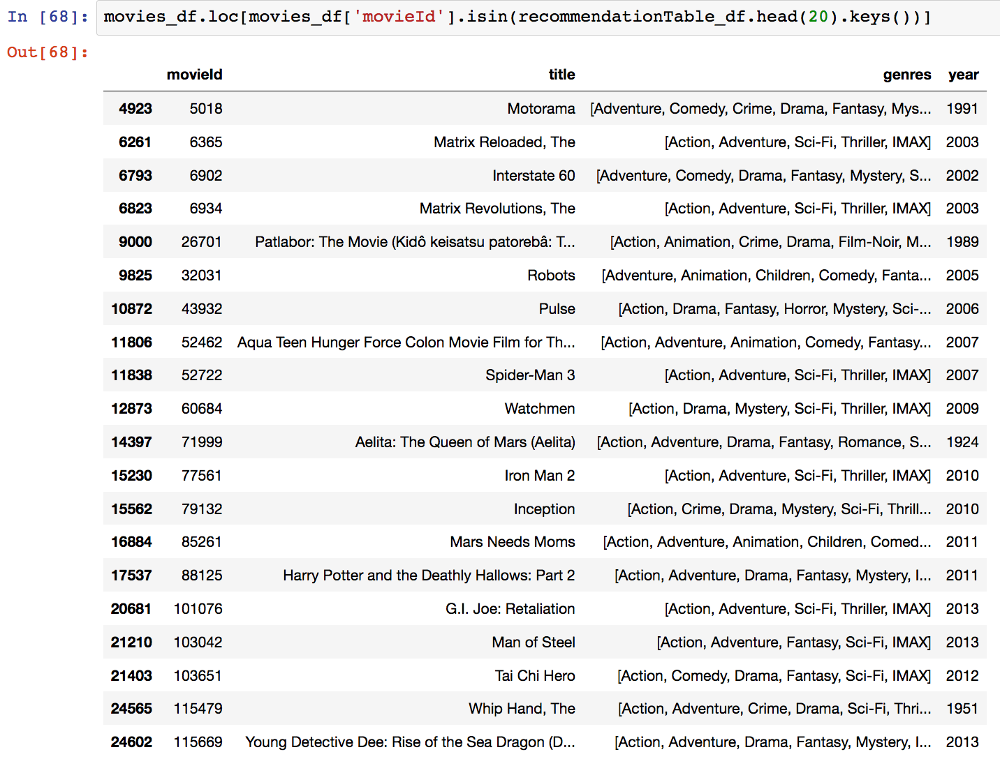

# ML-Recommendation-System

#### Question: Can we build a recommendation system that will recommend movies to user based on their viewing history/choosen movies?

In this project, I tried to predict similar movies based on user's chosen movies. This same logic can be applied to library books, TV shows, products, etc.

We start by loading the data into pandas data frames.

    movies_df = pd.read_csv('data/movies.csv')
    ratings_df = pd.read_csv('data/ratings.csv')
    
Let's also remove the year from the title column by using pandas' replace function and store in a new year column.

once that is done, we split the values in the Genres column into a list of Genres to simplify future use. This can be achieved by applying Python's split string function on the correct column.

    movies_df['genres'] = movies_df.genres.str.split('|')

Since keeping genres in a list format isn't optimal for the content-based recommendation system technique, we will use the One Hot Encoding technique to convert the list of genres to a vector where each column corresponds to one possible value of the feature. This encoding is needed for feeding categorical data. In this case, we store every different genre in columns that contain either 1 or 0. 1 shows that a movie has that genre and 0 shows that it doesn't. Let's also store this dataframe in another variable since genres won't be important for our first recommendation system.

Let's create user input to recommend movies to. Write movie names with capital letters and if a movie starts with a "The", like "The Matrix" then write it in like this: 'Matrix, The' .

We're going to start by learning the input's preferences, so let's get the subset of movies that the input has watched from the Dataframe containing genres defined with binary values.

    userMovies = moviesWithGenres_df[moviesWithGenres_df['movieId'].isin(inputMovies['movieId'].tolist())]

We'll only need the actual genre table, so let's clean this up a bit by resetting the index and dropping the movieId, title, genres and year columns.

Let's turn each genre into weights. We can do this by using the input's reviews and multiplying them into the input's genre table and then summing up the resulting table by column.

Now, we have the weights for every of the user's preferences. Using this, we can recommend movies that satisfy the user's preferences.

Let's start by extracting the genre table from the original dataframe:

With the input's profile and the complete list of movies and their genres in hand, we're going to take the weighted average of every movie based on the input profile and recommend the top twenty movies that most satisfy it.

And then we get the recommendation table

